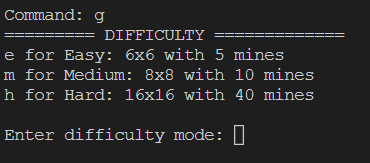

# Minesweeper CLI

An adaptation of the popular Minesweeper game on command-line.

#### Video Demo:

#### Decription

========= Getting Player's Name =========

The first thing program does is asking user for their name.

========= Welcome Screen =============

- "Welcome to Minesweeper" written fancily using `pyfiglet`library
- Program will greet the player using `pyttsx3` module
- Will display all commands and their usages

========= Instructions ==============

Command: i 
Display game instructions on the terminal

========= High Score ================

Command: h 
Read from csv file and display 5 high scores.

======== Game =====================

Ask user for their preferred mode

- easy: 6x6 with 5 mines
- medium: 8x8 with 10 mines
- hard: 16x16 with 40 mines

========== Setup =====================

- Make board (list of lists with None)
- Plant bombs at random location
- At every other cell, put numbers indicating number of bombs in surrounding cell
- Used `tabulate` library to print the board.
- Used `timeit` module to keep track of player's time.

============ Playing the game ===========

Continuously Ask player for row, col they want to dig

- If cell is a bomb, game over
- else, continue digging
  until all non-bomb cells are discovered

### Sample

##### Welcome Screen

##### Instructions

##### High scores

##### Difficulty mode

##### Game in Action

